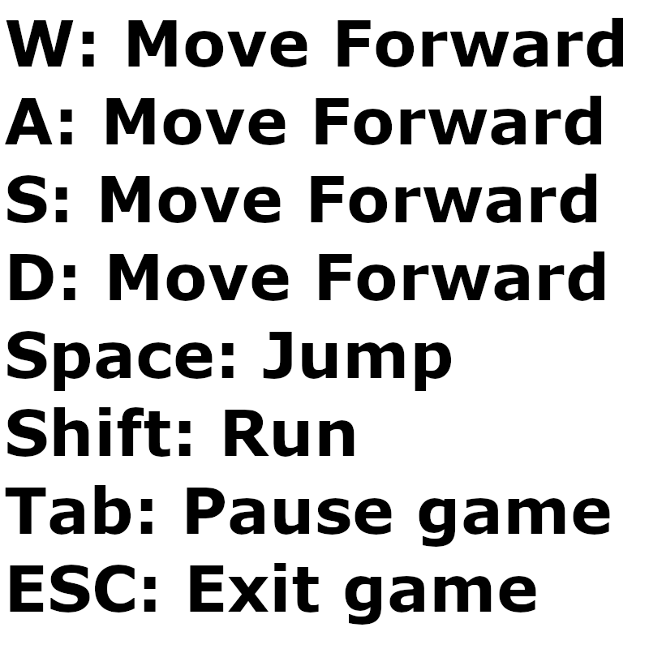

# Block Mayham 
A 3D game created using the Ursina engine for python.
### Singleplayer 
In this game mode you have to destroy other enemies that keep spawning. They will come after you untill you destroy them.
if they come near you, you take damage and once you have taken too much damage, you'll die! You get points for destroying the enemies.
### Multiplayer
In this game mode you will play against other players. You'll have several obsticles to hide behind but once you take too much damage, you'll die!
### Controlls

### To play Multiplayer on you local machine, first start the server.exe file and after that launch the game.
### *For this python project the following modules are used:*
* Ursina
* turtle
* numpy
* perlin-noise
### *After the game was finished, auto-py-to-exe was used to convert the files to an .exe file*
### The original game files are also in this repository and you'll find a link to a YouTube video explaining the game.
[Link to YT vid](https://www.youtube.com/watch?v=qiSDVWox7G8&ab_channel=BehradK.Farahani)

### If you don't have python installed, just download the files below and click on the BlockMayham.exe file
[Click for .exe game files](https://1drv.ms/u/s!Ap7_zG2013MSjd1sLJa0xNIXAFReCw?e=agYuoe)

### If you want to launch the game using python, type the following commands in the games' directory:

    pip install ursina

    pip instal perlin-noise

### After that, simply type the following:

    python blockmayham.py

### To play local multiplayer type the following:

    python server.py

    python blockmayham.py

## ENJOY!
